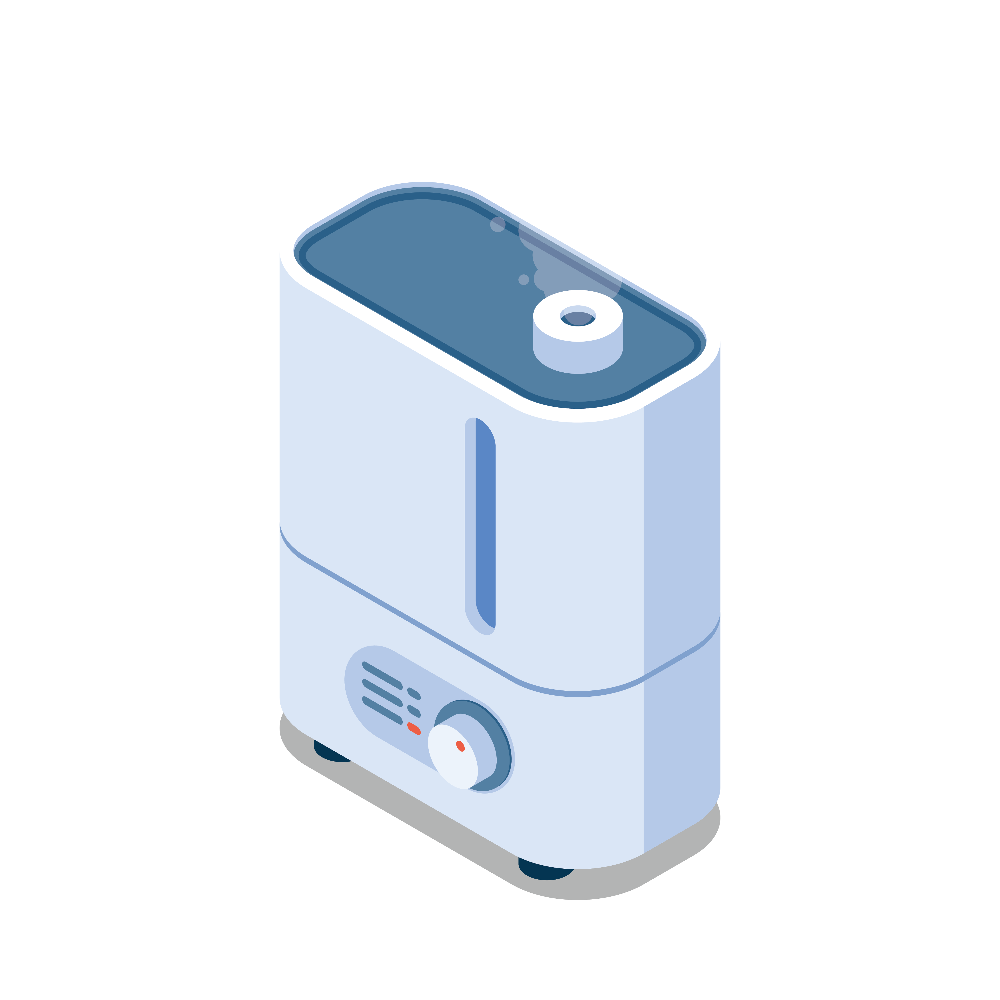

<div align="center">
<center>
  
  <h1>gboil-cli</h1>
  
  <br/>
  <a href="https://www.freepik.com/author/macrovector">Logo Designed by macrovector / Freepik</a>
</center>
</div>
<br/>
<br/>

## Install

```bash
brew install gboil
```

## Usage

```bash
Easy to use boilerplate generator for Go, Rust, Javascript and more.

See github.com/goboiler/goboil for more information.

Usage:
  gboil [command]

Available Commands:
  completion  Generate the autocompletion script for the specified shell
  get         Get a boilerplate
  help        Help about any command

Flags:
  -h, --help   help for gboil

Use "gboil [command] --help" for more information about a command.
```

